## Electrónica Digital III - UNC - FCEFyN

# Instalación de IDE y creación de proyecto

## MCUXpresso IDE

    Una IDE o entorno de desarrollo integrado es un sistema de software para el diseño de aplicaciones que combina herramientas del desarrollador comunes en una sola interfaz gráfica de usuario. Generalmente un IDE cuenta con las siguientes características:

- **Editor de código fuente:** Editor de texto que ayuda a escribir el código con funciones como el resaltado de la sintaxis con indicaciones visuales, el relleno automático específico para el lenguaje y la comprobación de errores a medida que se escribe el código.

- **Automatización de las compilaciones locales:** Herramientas que automatizan las tareas sencillas y repetitivas como la compilación del código fuente en un archivo binario.

- **Depurador:** Software para probar los programas y mostrar la ejecución paso a paso para facilitar el debug.


### Instalación

    Para la instalación de esta IDE será necesario descargar el instalador de la página oficial de NXP. Para esto dirigirse al siguiente link, registrarse e ingresar a la sección de descargas.


[MCUXpresso IDE for NXP MCUs | Linux, Windows and MacOS | NXP Semiconductors | NXP Semiconductors](https://www.nxp.com/design/software/development-software/mcuxpresso-software-and-tools-/mcuxpresso-integrated-development-environment-ide:MCUXpresso-IDE)


    Se deberán aceptar los terminos y condiciones y luego nos llevará a una ventana con todos los instaladores disponibles. Descargar el adecuado para su sistema operativo (Linux, macOS, Windows).

    En esta muestra se instalará para una distribución de Ubuntu 22.04. En caso de tener Windows como sistema operativo, el instalador que se descarga es un .exe que simplemente hay que ejecutar y seguir las instrucciones de instalación. A partir de la sección "Creación de un nuevo proyecto" es lo mismo para cualquier sistema operativo.

    Una vez descargado el archivo:


1. Abrir una terminal y dirigirse al directorio donde se descargó el archivo

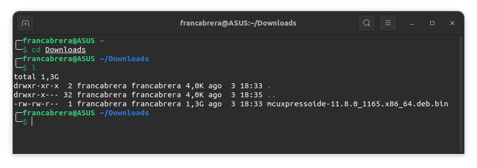

2. Darle permisos de ejecución

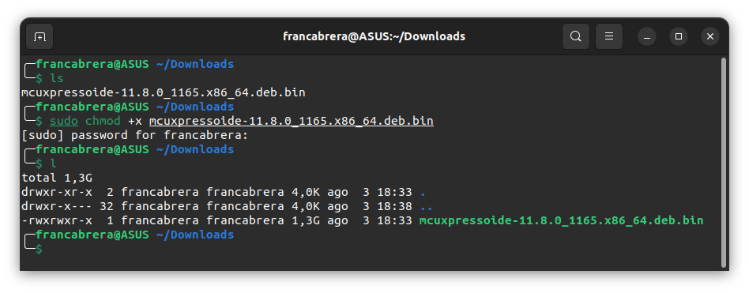

3. Ejecutar 

```bash
sudo ./mcuxpressoide-11.8.0_1165.x68_64.deb.bin
```

4. Seguir las instrucciones de instalación


## Creación de un nuevo proyecto

    Al ejecutar la aplicación, lo primero que nos aparecerá será la elección de un workspace. 


    Este espacio de trabajo es el directorio principal en el que se almacenarán y organizarán los proyector y archivos relacionados con el desarrollo. Es el área en la que se trabaja con los proyectos y la IDE guarda los archivos de configuración y datos asociados. 

    El concepto de espacio de trabajo es útil porque te permite mantener tus proyectos organizados y separados. Puedes trabajar en múltiples proyectos en paralelo y cambiar fácilmente entre ellos dentro de la IDE. Además, el espacio de trabajo almacena las preferencias y configuraciones de la IDE, como el esquema de color, atajos de teclado y configuraciones del depurador, entre otras cosas.

    Esta ruta puede dejarse por defecto o se puede colocar otra.

    Al dar click en lanzar, se nos abrirá la ventana principal de la IDE.

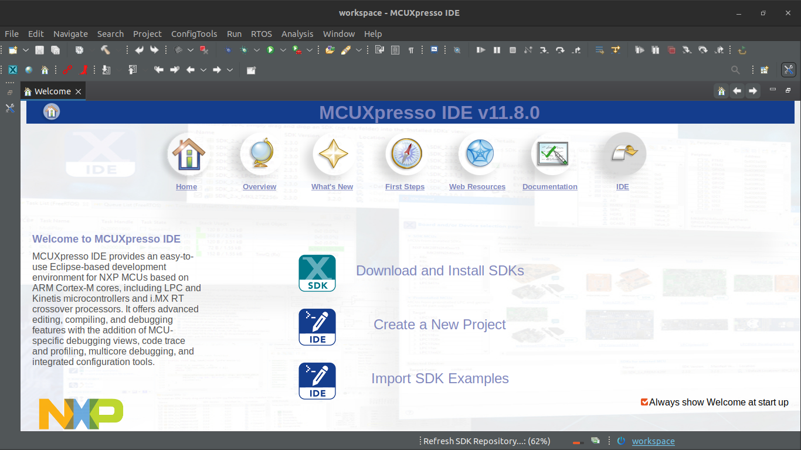


    Para crear un nuevo proyecto, nos dirigimos a `file>new>create a new C/C++ project`.

    En el SDK wizard, primero debemos seleccionar la placa que usaremos en nuestro proyecto, en nuestro caso será LPC 1769

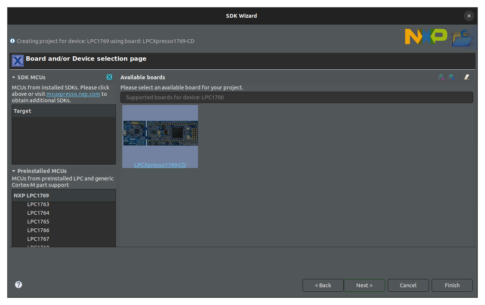

    Luego, elegir la opción `C project`

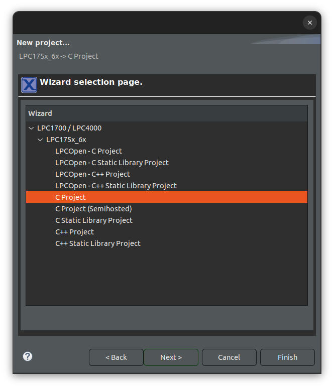

    Elegir el nombre y ubicación del proyecto

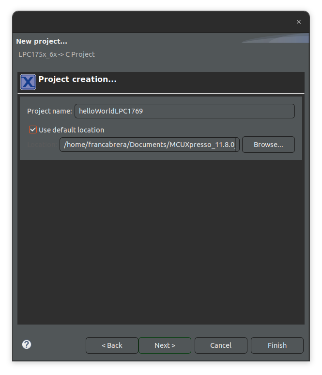

    Seleccionar las librerías de CMSIS (Common Microcontroller Software Interface Standar). Esta librería proporciona una capa de abstracción de software que facilita el desarrolllo de software embebido para microcontroladores basados en la arquitectura ARM Cortex-M.

    Para incluirla, hacer click en `import`, esto nos abrirá la siguiente ventana

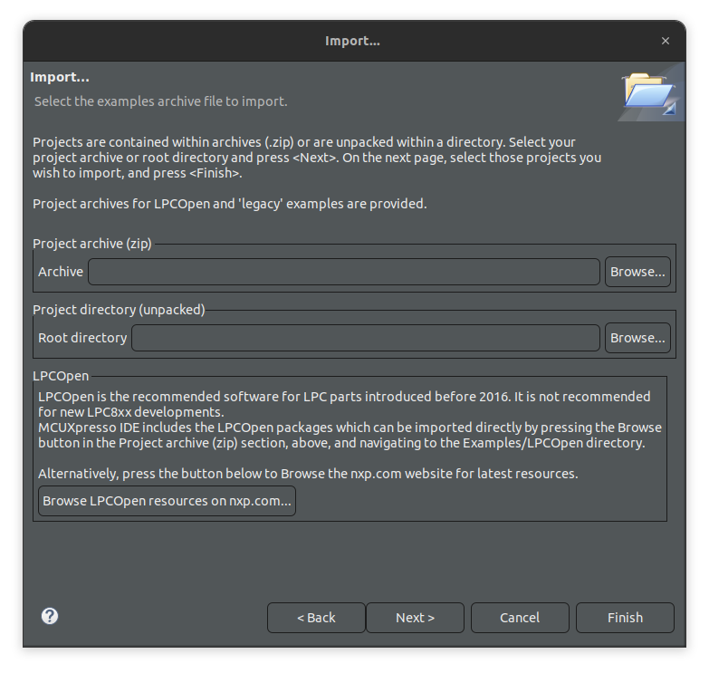

    En `Project archive (zip)`dar click en `Browse`. Allí dirigirse al path `Legacy>NXP>LPC1000>LPC17xx` y seleccionar la carpeta comprimida `LPCXpresso176x_cmsis2.zip`.

    Una vez importada, nos pedirá que indiquemos que proyectos incluir, ya que viene con algunos ejemplos

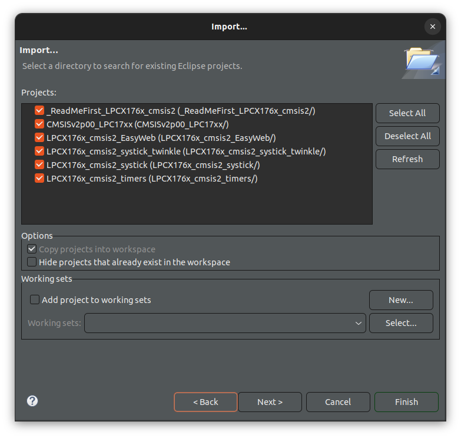

    El que debemos importar si o si, es el CMSISV2p00, los demás son opcionales. Una vez importada, selccionarla

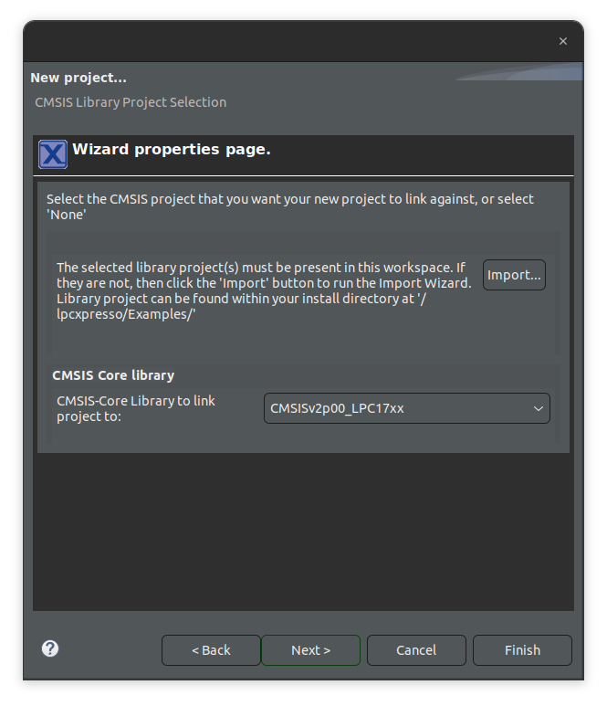

    En las librerías de DSP no es necesario seleccionar nada, simplemente dar a siguiente.

    Por último, nos da la opción de elegir la estructura de directorios del proyecto. Dandonos la posibilidad de cambiar el nombre del directorio para los fuentes y la posibilidad de crear un directorio 'inc' para los headers file y añadir automáticamente al path este mismo.

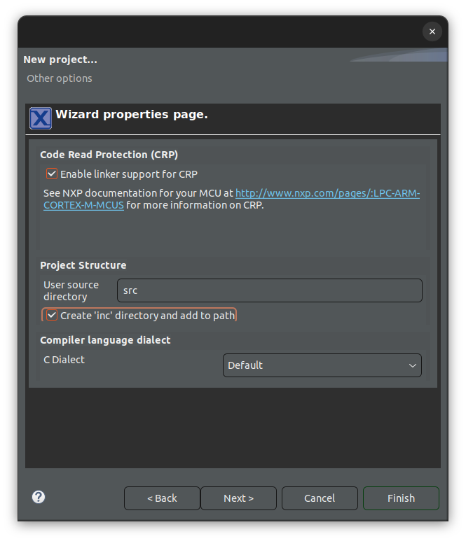

    Al dar en "Finish", se nos abrirá la ventana de nuestro proyecto con un main básico.

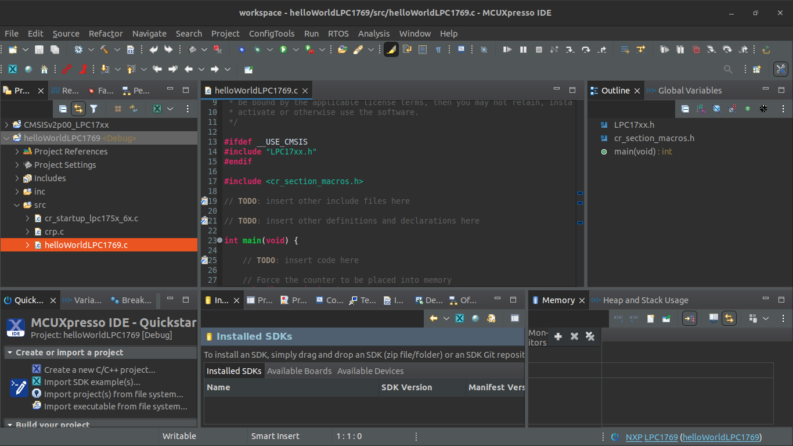


    Una forma de verificar que todo esté correcto, es compilando el proyecto, para esto, seleccionar el ícono del martillo que se encuentra en el menú. Si todo está correcto, veremos en la consola el mensaje 

```bash
19:17:23 Build Finished. 0 errors, 0 warnings. (took 219ms)
```


