## Electrónica Digital III - UNC - FCEFyN

# GPIO

[Datasheets](https://drive.google.com/drive/folders/10A9xhIxx6ag75GtEwLzxr8pCdP6hR1HC )

Ver capítulo 9 del User Manual.

## Características

### Entradas salidas digitales

- Funciones:
  
  - Los registros de GPIO están ubicados en el AHB bus
  
  - Registros enmascarables permiten modificar conjuntos de puertos como un grupo, dejando otros sin modificar.
  
  - Todos los registros de GPIO accesibles como bytes, half-words y words.
  
  - Todo el puerto puede ser modificado en una sola instrucción.
  
  - Los registros de GPIO son accesibles por el GPDMA.

- Registros de set y clear a nivel de bit permiten con una simple instrucción poner en alto o bajo el estado de cualquier numero de bits en un puerto.

- Todos los registros de GPIO soportan [Cortex-M3 bit-banding](https://developer.arm.com/documentation/ddi0337/h/programmers-model/bit-banding).

- Los registros de GPIO son accesibles por el GPDMA para permitir el acceso directo a memoria de datos hacia o desde los GPIOS, sincronizado con cualquier solicitud de DMA.

- Control de dirección individual por bits.

- **Todos los IO se configuran por defecto luego del reset como entradas con pull-up**

### Interrupciones

- El puerto 0 y puerto 2 pueden proporcionar una sola interrupción para cualquier combinación de pines del puerto.

- Cada puerto puede ser programado para generar una interrupción en un rising edge, falling edge o ambos.

- La detección de flanco es asincrónica, por lo tanto puede funcionar cuando los relojes no están activos, como durante el Power-down mode. 

- Las interrupciones de GPIO0 y GPIO2 comparten la misma posición en el NVIC con "External interrupt 3".

## Registros asociados a la configuración

    Los registros de la siguiente tabla, representan las características disponibles en todos los puertos de GPIO. Estos registros están ubicados en el AHB bus para una lectura y escritura rápida. Todos estos registros pueden ser accedidos en bytes, half-words (2 bytes) y words (4bytes). El registro MASK permite acceder a grupos de bits de un puerto GPIO independientemente de otros bits en el mismo puerto.

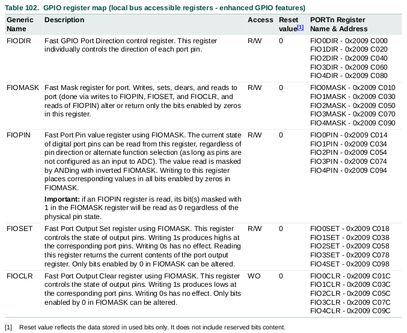

    Los siguientes registros están asociados a las interrupciones de GPIO

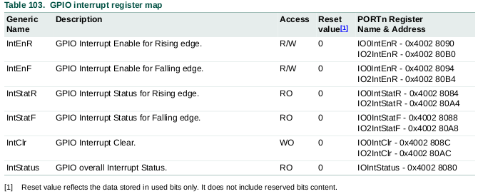

    A partir de aquí, en el user manual encontraremos la definición a detalle de cada uno de estos registros.

    Sumado a estos, también debemos revisar los registos asociados a la funcionalidad de los pines, estos registros son PINSEL y PINCON y se nombran en el capítulo 8 del user manual.

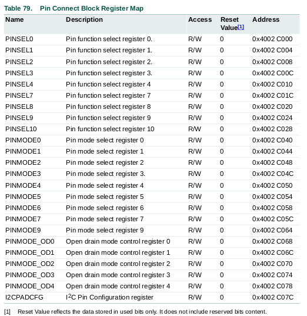

## Ejemplo - Blink

    Ver archivo `blink.c`en el directorio `src`.

    En este ejemplo, se encenderán y apagarán de manera periódica los leds integrados de la LPC1769. En el caso de la REVD1, cuenta con un led RGB con la siguiente asignación de pines.

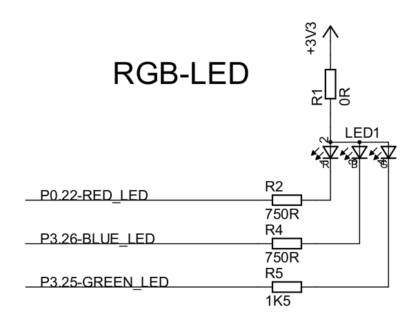

    A partir de esto, seguimos los siguientes pasos para configurar la funcionalidad de estos pines y poderutilizarlos.

### Primer paso - PINSEL

    Los registros PINSEL sirven para elegir la función de cada pin del micro controlador.

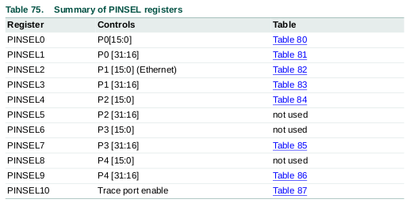

    En nuestro caso, queremos utilizar los pines P0.22 (Led Rojo), P3.25 (Led Verde) y P3.26 (Led Azul). Para esto debemos hacer uso de los registros PINSEL1 (para P0.22) y PINSEL7 (para P3.25 y P3.26).

    Viendo más a detalle estos registros, observamos lo siguiente:

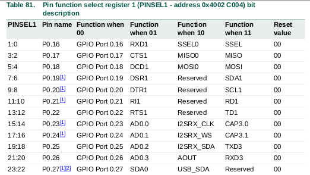

    Para configurar el P0.22 como GPIO, es necesario colocar el valor 0b00 en los bits 13:12 del registro. Notar que por defecto ya comienzan en este valor luego del reset. Por ahora ignoraremos esto y lo configuraremos de igual manera.

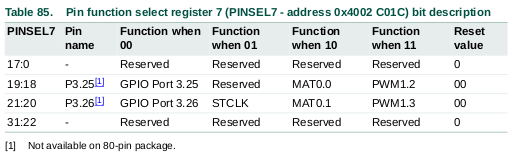

    Para configurar los pines P3.25 y P3.26 como GPIO, es necesario colocar el valor 0b00 en los bits 19:18 y 21:20 del regustro.

### Segundo paso - PINMODE

    En caso de necesitar configurar el modo del pin, hay que revisar el registro PINMODE, el cual ofrece las siguientes posibilidades.

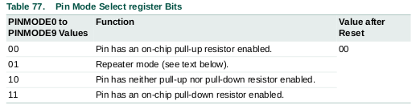

    Luego, hay que revisar cual de los PINMODEx es el que hay que modificar en función de nuestro pin.

### Tercer paso - FIODIR

    Con este registro, podemos elegir la dirección del pin, esto es, entrada o salida.

    En el user manual encontramos:

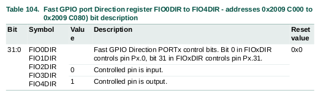

    Notar que hay un FIODIR para cada puerto, por lo tanto, si queremos configurar el pin P0.22 debemos modificar el valor del bit 22 del registro FIO0DIR y así con los otros.

### Cuarto paso - FIOSET - FIOCLR

    Mediante estos dos registros, podemos controlar el valor de la salida del pin. 

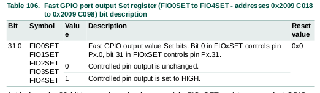

    Al colocar un '1' en el registro FIOSET, el pin correspondiente al número de bit en el que se colocó dicho '1' conmutará su salida a un estado alto. El colocar un '0' en el mismo bit NO cambiará el estado.

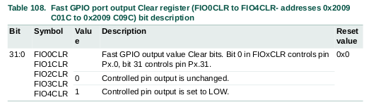

    Al colocar un '1' en el registro FIOCLR, el pin correspondiente al número de bit en el que se colocó dicho '1' conmutará su salida a un estado bajo. El colocar un '0' en el mismo bit NO cambiará el estado.
