## Electrónica Digital III - UNC - FCEFyN

# Interrupciones de GPIO

[Datasheets](https://drive.google.com/drive/folders/10A9xhIxx6ag75GtEwLzxr8pCdP6hR1HC)

Ver capítulo 9 y 3 del User Manual

## Interrupciones

Las interrupciones de GPIO pueden ser de dos tipos:
- Utilizando cualquier pin de los puertos 0 y 2
- Utilizando pines específicos de interrupciones externas

Las interrupciones son manejadas por el NVIC, que es un hardware dedicado al manejo de interrupciones. Es vectorizado debido a que hay posiciones de memoria determinadas a las que saltará el programa ante alguna interrupción, permitiendo identificar cual será la ISR que se llamará cuando un periférico específico genere una initerrupción.
Se permite atender a múltiples interrupciones (según prioridades).

### Interrupciones de GPIO0 y GPIO2
- Los puertos 0 y 2 pueden generar interrupciones al microprocesador.
- Cada pin del puerto puede programarse para generar interrupciones por flanco ascendente, descendente o ambas.
- La detección de flanco es asincrónica por lo tanto pueden operar aunque el clock no está presente (Power down mode).
- Las interrupciones de GPIO0 y GPIO2 comparten la misma posición en el NVIC con la "External Interrupt 3". Dado esto, es necesario verificar en el programa cual pin fue el que interrumpio una vez que ingresamos a la ISR.
- Algunos registros proveen una vista por software de interrupciones pendientes.

#### Registros asociados a las interrupciones de GPIO
En el user manual, tabla 103 podemos ver los registros asociados a la configuración de interrupciones de GPIO.

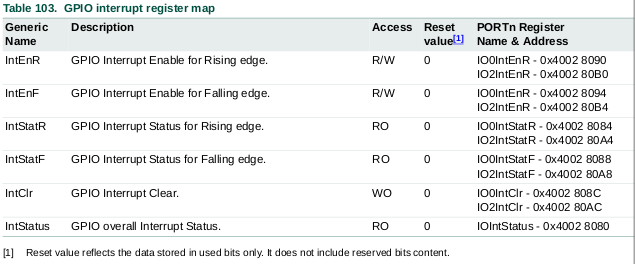

En la sección 9.5.6 del User Manual podemos ver más detalles de estos registros.

#### IOIntStatus
Es un registro de solo lectura que nos indica la presencia de interrupciones pendientes en todos los puertos que soportan interrupciones. Solo son necesarios un bit por cada puerto.

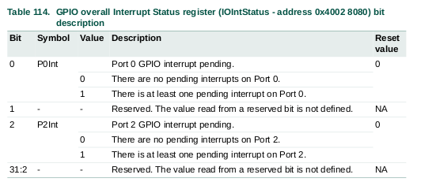

#### IO0IntEnR - IO2IntEnR
Cada bit de estos registros habilita la interrupción por flanco de subida para el bit correspondientedel puerto 0 o 2.
Al colocar el valor del bit en 1 se habilita las interrupciones por flanco ascendente para el puerto correspondiente al registro y el pin correspondiente al número de bit.

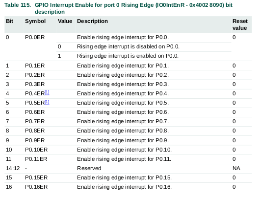

A modo de ejemplo se presenta una parte del registro IO0IntEnR.

#### IO0IntEnF - IO2IntEnF
Cada bit de estos registros habilita la interrupción por flanco de bajada para el bit correspondientedel puerto 0 o 2.
Al colocar el valor del bit en 1 se habilita las interrupciones por flanco descendente para el puerto correspondiente al registro y el pin correspondiente al número de bit.

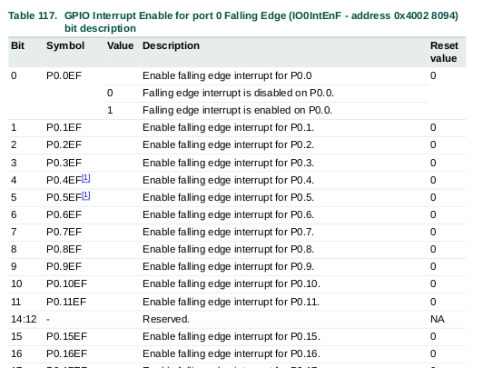

A modo de ejemplo se presenta una parte del registro IO0IntEnF.

#### IO0IntStatR - IO2IntStatR
Cada bit de estos registros de solo lectura indica si hay una interrupción por flanco ascendente pendiente para el puerto 0 o puerto 2 dependiendo el registro.
En caso de encontrar un 1, una interrupción por flanco ascendente fue generada por el pin correspondiente al número de bit.

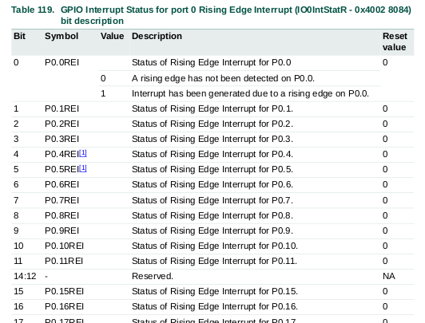

A modo de ejemplo se presenta una parte del registro IO0IntStatR.

#### IO0IntStatF - IO2IntStatF
Cada bit de estos registros de solo lectura indica si hay una interrupción por flanco descendente pendiente para el puerto 0 o puerto 2 dependiendo el registro.
En caso de encontrar un 1, una interrupción por flanco descendente fue generada por el pin correspondiente al número de bit.

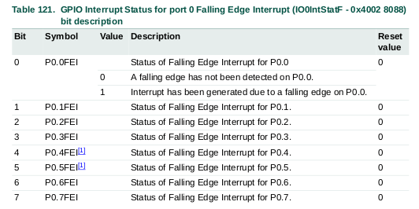

A modo de ejemplo se presenta una parte del registro IO0IntStatF.

#### IO0IntClr - IO2IntClr
Al escribir un 1 en un bit de este registro, se limpia cualquier interrupción pendiente del correspondiente bit del registro.

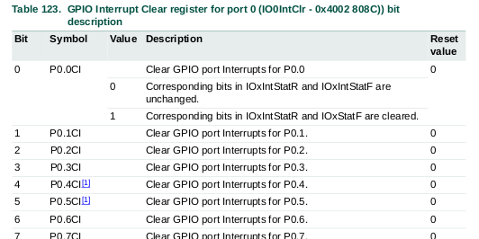

A modo de ejemplo se presenta una parte del registro IO0IntClr.

#### Ejemplo 
Para ver un ejemplo sobre esto, ver el archivo `src/gpioInt.c`.

En este ejemplo simple, se configuraron tres pines del puerto 0 como entradas con interrupciones habilitadas. 

En la ISR, se puede ver que en función del pin que genere la interrupción se enciende un led de cada color. Los pines que interrumpen son los siguientes:

- P0.9
    - Entrada digital con pullup, interrumpe por flanco descendente.
    - Al colocar el pin a 3.3V no interrumpe, al poner el pin a GND se produce la interrupción y enciende el led rojo.
- P0.10
    - Entrada digital con pulldown, interrumpe por flanco ascendente.
    - Al colocar el pin a GND no interrumpe, al poner el pin a 3.3V se produce la interrupción y enciende el led verde.
- P0.11
    - Entrada digital con pullup, interrumpe por ambos flancos.
    - Inicialmente al colocar el pin a 3.3V no interrumpe debido a que ya se encontraba en estado alto por la pullup. Al colocar el pin a GND se genera la interrupción por flanco descendente. Si se saca el pin de GND se producirá una nueva interrupción, ahora por flanco ascendente debido a la pullup. Se enciende el led Azul.

Una buena forma de analizar este código es mediante un proceso de debug colocando un breakpoint en la ISR.

### Interrupciones externas
Se cuenta con cuatro interrupciones externas, estas son EINT0, EINT1, EINT2 y EINT3. Esto no es una funcion de GPIO si no que es una funcionalidad específica de un pin, por lo tanto es necesario configurar ese pin con dicha funcionalidad.

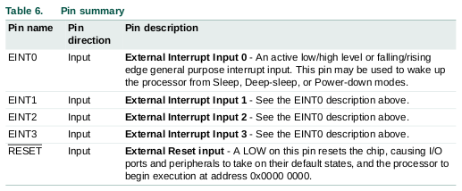

Estos pines al configurarse como interrupción externa permiten interrumpir al procesador por nivel alto/bajo o por flanco ascendete/descendente.

Es importante destacar que cada una de las interrupciones externas tiene un vector de interrupción propio asociado (salvo EINT3 que lo comparte con las interrupciones de GPIO).

#### Registros asociados a la configuración de EINT

Inicialmente podemos observar el registro PINSEL4, donde vemos que los bits 20:27 están asignados a la configuración de las interrupciones externas. 

En la siguiente tabla se pueden ver los 3 registros asociados a la configuración y uso de interrupciones externas

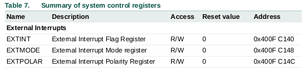

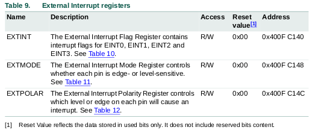

#### EXTINT
Cuando un pin es configurado como interrupción externa, el nivel o flanco en ese pin (seleccionado por los registros EXTMODE y EXTPOLAR) activará una bandera de interrupción en este registro con una solicitud al NVIC. En caso que las interrupciones de dicho pin estén habilitadas, causará una interrupión al microprocesador.

Escribir un 1 en los bits EINT0 a EINT3 borrará el correspondiente bit.

En el modo de interrupción por nivel, la interrupción se borra sólo cuando el pin está en su estado inactivo.

#### EXTMODE
Los bits en este registro seleccionan si cada pin es level-sensitive o edge-sensitive.

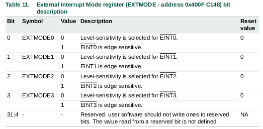

En el modo level-sensitive, este bit selecciona si el correspondente pin es high-active o low-active. En el modo edge-sensitive este bit selecciona si el pin es sensible a falling-edge o rising-edge.

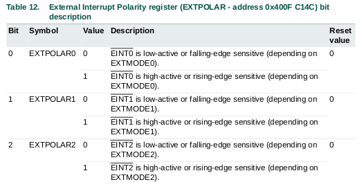

#### Ejemplo
Para ver un ejemplo sobre esto, ver el archivo `src/externalInterrupt.c`.

Este ejemplo hace lo mismo que el anterior. La diferencia está en que se usan las interrupciones externas EINT0, EINT1 y EINT2.

Una buena forma de analizar el comportamiento del programa es en una sesión de debug colocando breakpoints en las ISR de cada EINT.