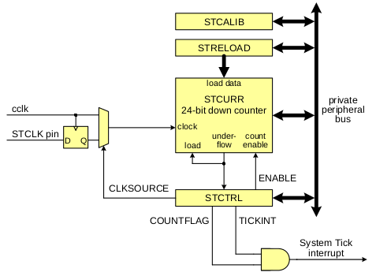
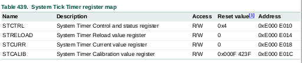
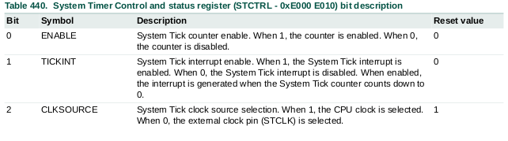
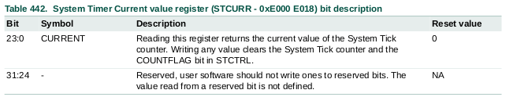
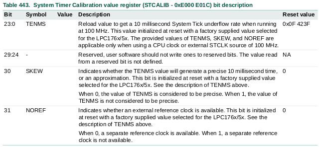

## Electrónica Digital III - UNC - FCEFyN

# SysTick

[Datasheets](https://drive.google.com/drive/folders/10A9xhIxx6ag75GtEwLzxr8pCdP6hR1HC)

Ver capítulo  23 del User Manual

## Descripción

    El SysTick timer está integrado en el core del Cortex-M3. Este, está destinado a generar una interrupción fija de 10 milisegundos para su uso por un sistema operativo u otro software de gestión del sistema. Dado que el SysTick es parte del Cortex-M3, permite la portabilidad del software al proveer un temporizador estándar que se encuentra disponible en todos los cores basados en Cortex-M3 (No sucede esto con los perisféricos timer).

## Características

- Intervalos de tiempo de 10 milisegundos (Ver condiciones)

- Vector de excepcion dedicado

- Su fuente de reloj puede ser interna con el CPU o externa mediante un pin (STCLK).

## Configuración básica

    La configuración del SysTick Timer se hace usando los siguientes registros:

1. **Clock Source:** Seleccionar entre el clock interno CCLK o el externo en el pin STCLK (P3.26) para ser la fuente de reloj con el registro STCTRL.

2. **Pins:** Si el pin STCLK (P3.26) es seleccionado como fuente de reloj se debe habilitar esta función con el registro PINSEL correspondiente.

3. **Interrupt:** Las interrupciones del SysTick timer son habilitadas en el NVIC utilizando el correspondiente "Interrupt set enable register".

## Operación

    El SysTick Timer es un contador descendente de 24-bits que produce una interrupción al llegar al valor 0. La intención es proveer intervalos de tiempo fijos de 10 milisegundos entre interrupciones.

    Con el fin de generar interrupciones a un intervalo de tiempo especifico, el registro STRELOAD debe inicializarse con el valor correcto para el intervalo deseado. Un valor por defecto es provisto en el registro STCALIB y puede ser cambiado por software. El valor por defecto da un periodo de 10 milisegundos por interrupción si el reloj está configurado a 100MHz.

    **Nota:** La máxima frecuencia permitida en el STCLK es 1/4 del CCLK.

## Diagrama de bloques

    En el diagrama de bloques se observa el funcionamiento básico del SysTick Timer.

## Descripción de registros

    Aquí se pueden observar los registros que intervienen en la configuración y el uso del SysTick. A continuación se presenta a detalle cada uno:

### STCTRL

    Este registro, contiene la información de control del System Tick timer y provee una bandera de estado.

### STRELOAD

    El registro de recarga contiene el valor con el que se cargará el contador cada vez que este llegue a cero. Este registro es cargado mediante software como parte de la inicialización del timer. El registro STCALIB puede ser leido y utilizado como valor para el STRELOAD.

### STCURR

    Este registro retorna el valor actual del contador del SysTick al ser leido.

### STCALIB

    Este registro contiene un valor que es inicializado por el código de arranque (Boot). Este valor viene previsto de fabrica para generar interrupciones de 10 ms si el SysTick tiene una fuente de clock de 100 MHz. 

    

    El valor por defecto que se encuentra en STCALIB es 0x0F423F, si suponemos que la frecuencia de reloj es de 100MHz, podemos calcular el tiempo que tarda en llegar hasta 0 (y generar una interrupción).

    Debido a que tiene que contar hasta 0, la cantidad de cuentas que hará será el valor de recarga + 1.

$$
Ticks = 999999+1 = 1000000
$$

$$
Frequency = 100[MHz]
$$

$$
Time = Ticks \hspace{2mm} \frac{1}{Frequency}
$$

$$
Time = \frac{1000000}{100000000[1/s]} =  0,01 [s] = 10[ms]
$$

## Ejemplos de cálculos

### Ejemplo 1

    En este ejemplo, el SysTick tiene como fuente de reloj el del CPU (CCLK) con una frecuencia de 100 MHz. Para lograr interrupciones cada 10 ms se debe cargar el contador con el siguiente valor:

    Dado que el timer se decrementa cada flanco del clock, podemos decir que el tiempo que tarda por cada cuenta es:

$$
T_{cuenta} = \frac{1}{cclk}
$$

    Ahora, podemos definir que el tiempo que tardará el contador en llegar a cero, está dado por:

$$
T_{total} = T_{cuenta} \hspace{2mm} N_{cuenta}
$$

    Donde $N_{cuenta}$ es el numero de cuentas que debe realizar el contador. Este valor se define como:

$$
N_{cuenta} = \frac{T_{total}}{T_{cuenta}} = T_{total}\hspace{2mm} cclk
$$

    Nuestro objetivo es que, al finalizar la cuenta, se haya logrado un tiempo de 10 ms, por lo tanto tenemos que:

$$
N_{cuenta} = 10 e^{-3} [s] \hspace{2mm} 100e^6 [Hz] = 1000000
$$

    Debido a que el contador es hasta cero, este debe cargarse con una unidad menos, por lo tanto:

$$
N_{cuenta} = 999999
$$

    En hexadecimal:

$$
N_{cuenta} = 0xF423F
$$

    Puede darse el caso en el que el número calculado no sea un valor entero y tendremos un error debido al redondeo.

## Ejemplos de uso

    El archivo `src/sysTick.c` contiene un ejemplo básico de uso. El timer genera interrupciones fijas de 10 ms y controla la salida de un led para generar una forma de onda.
