## Electrónica Digital III - UNC - FCEFyN

# Analog-to-Digital Converter (ADC)

[Datasheets](https://drive.google.com/drive/folders/10A9xhIxx6ag75GtEwLzxr8pCdP6hR1HC)

Ver capítulo 29 del user manual.

## Características

- Conversor analógico-digital de **aproximaciones sucesivas** de 12-bits.
- Entrada multiplexada de 8 canales
- Modo Power-Down
- Rango de medición de $V_{REFN}$ a $V_{REFP}$ (Normalmente 3[V]; no debe exceder el nivel de tensión de $V_{DDA})
- Tasa de conversión de 12 bits de 200[KHz]
- Modo burst (ráfaga) para una o múltiples entradas
- Conversión opcional en transición de un pin de entrada o señal de match de un timer.

## Descripción
La señal de clock para el A/D es provista por el APB clock. Un divisor programable se incluye en cada conversor para escalar esta señal de reloj hasta la frecuencia necesaria para el proceso de aproximaciones sucesivas (máximo 13[MHz]). Una conversión en modo ráfaga requiere 64 pulsos de reloj mientras que una conversión en modo normal requiere 65 pulsos de reloj.

La frecuencia de muestreo depende de la frecuencia de trabajo del ADC y de la cantidad de pulsos necesarios para la digitalización de una muestra. En nuestro caso, el la cantidad de pulsos es un número fijo de 65 (o 64 en modo burst). Por lo tanto, si nuestra frecuencia máxima de trabajo es de 13[MHz], podemos calcular la frecuencia de muestreo máxima de la siguiente manera:

$$
f_s = \frac{f_{APBclk}}{65} = \frac{13[MHz]}{65} = 200[KHz]
$$

Al tener una frecuencia de muestreo máxima de 200[KHz], podremos digitalizar señales cuya componente máxima de frecuencia sea de 100[KHz] (en caso de usar un único canal de entrada).

## Configuración básica
La configuración de ADC se hace utilizando los siguientes registros:

1. **Power:** En el registro PCONP se debe colocar un '1' en el bit PCADC. En el reset, el ADC se encuentra deshabilitado. Para habilitarlo, primero se debe setear el bit PCADC y luego habilitar el ADC en el registro AD0CR (tabla 532). Para deshabilitar el ADC, primero hacerlo desde el registro AD0CR y luego del PCONP.

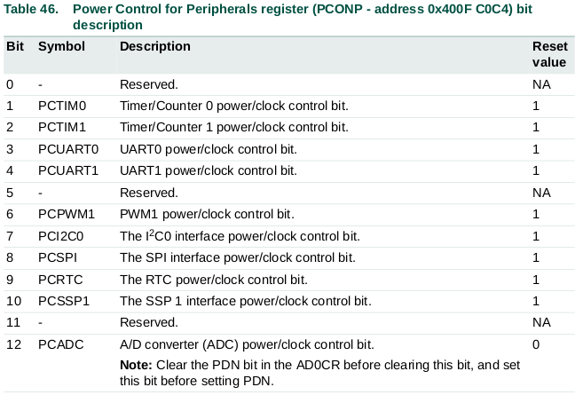

2. **Clock:** En el registro PCLKSEL0 (tabla 40) seleccionar PLCK_ADC. Para escalar el valor de frecuencia ver el CLKDIV de la tabla 532.

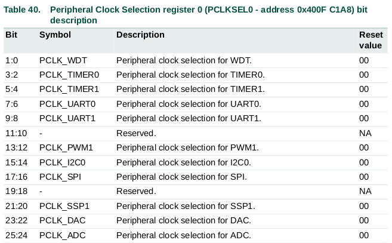

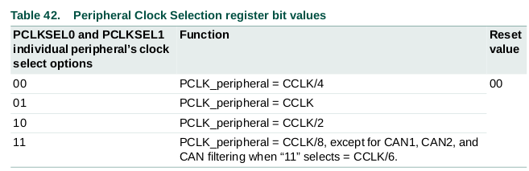

3. **Pines:** Para habilitar los pines de entrada del ADC se deben utilizar los registros PINSEL y PINMODE.

4. **Interrupciones:** Para la habilitación de las interrupciones ver la tabla 536. Las interrupciones son habilitadas en el NVIC utilizando el registro de habilitación de interrupciones correspondiente.

## Descripción de pines

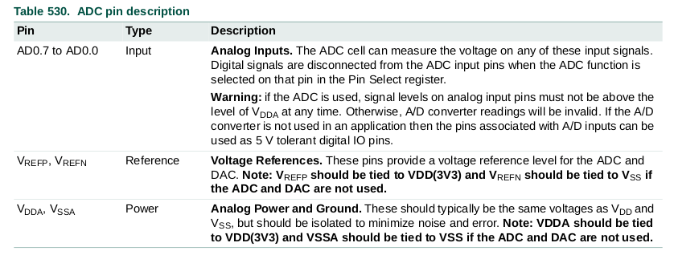

## Descripción de registros

Los registros asociados a la configuración del ADC son los siguientes:

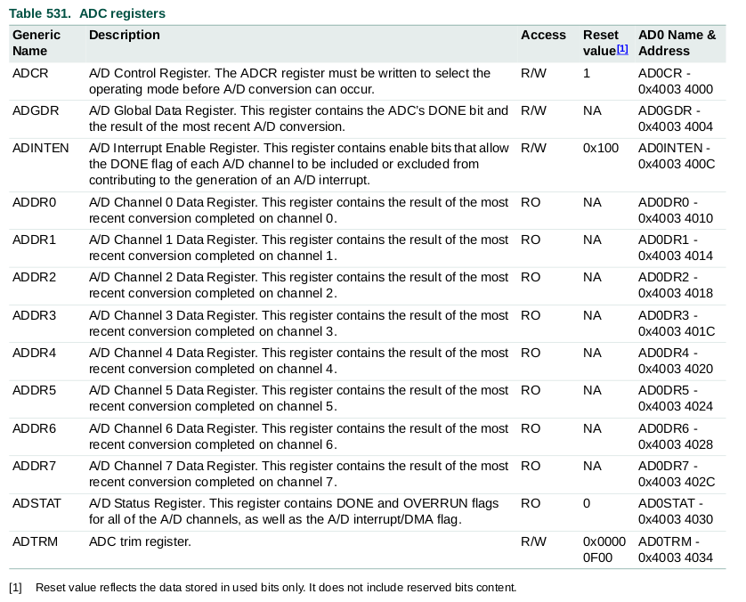

### A/D Control register (AD0CR)

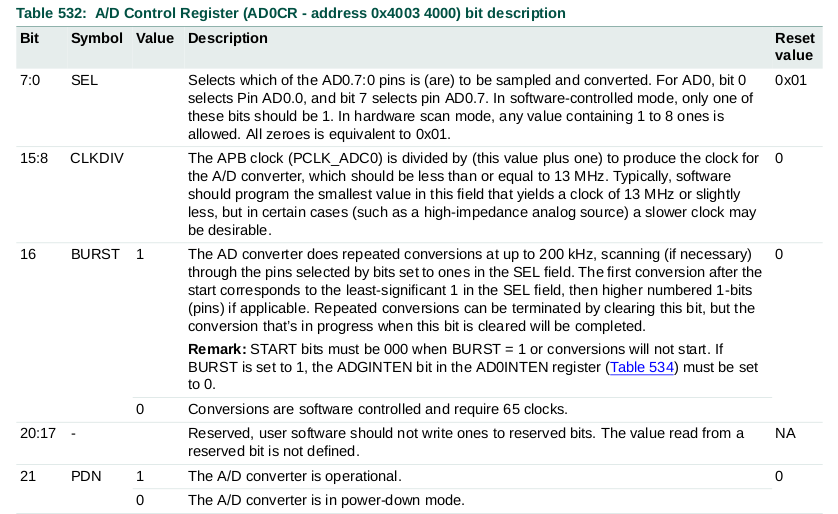
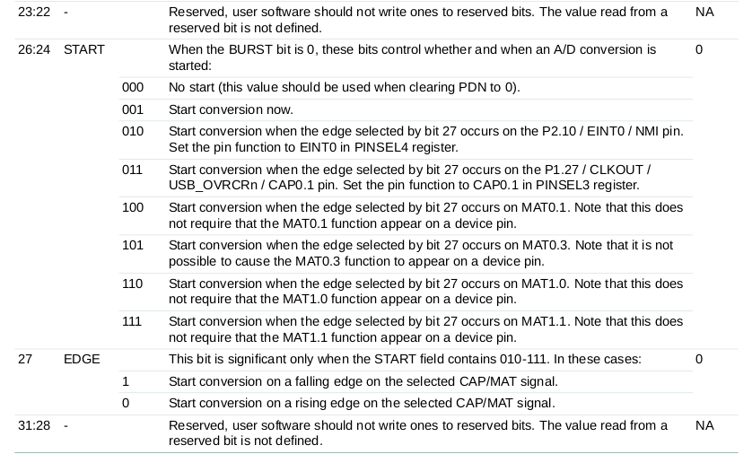

### A/D Global Data Register (AD0GDR)

Este registro, tiene el resultado de la última conversión que se realizó, también incluye de las banderas de estado de dicha conversión.

Los resultados de la conversión del ADC pueden ser leídos de dos formas diferentes. Una es usando este registro y otra es utilizando los A/D channel data Registers. Es importante usar un método de manera consistente debido a que las banderas de DONE y OVERRUN pueden desincronizarse entre el AD0GR y el A/D channel register. 

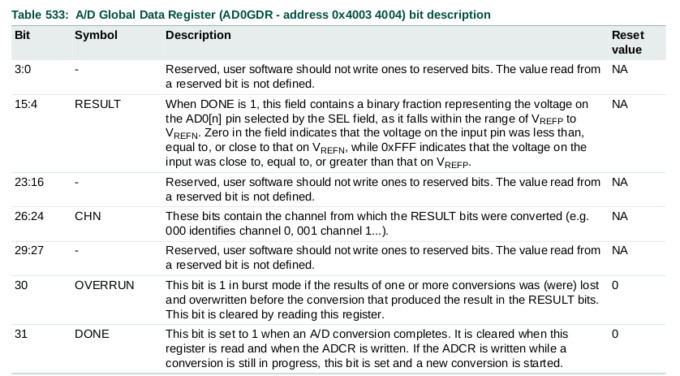

### A/D Interrupt Enable Register

Este registro permite controlar cual de los canales del AD genera una interrupción cuando la conversión se completa. 

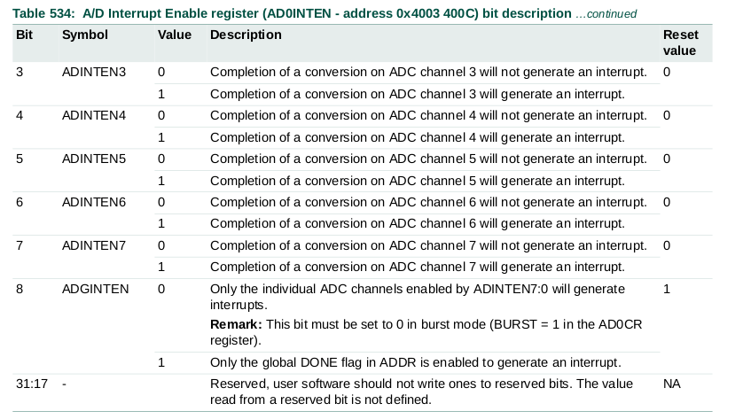

### A/D Data Register (AD0DR0 to AD0DR7)

Estos registros mantienen el resultado de la última conversión de cada uno de los canales del ADC. Esto también incluye las banderas que indican cuando una conversión fue completada y cuando un overrun ha ocurrido.

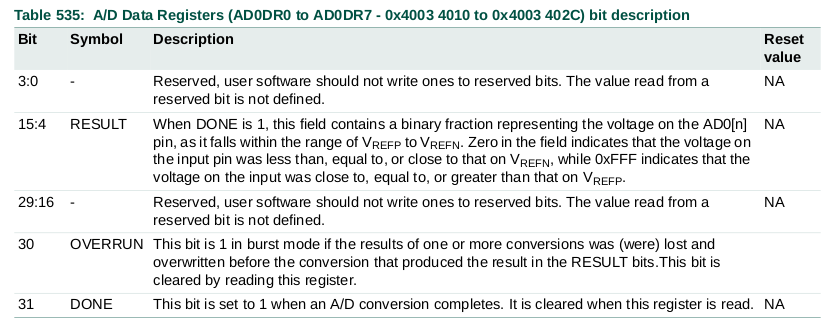

### A/D Status Register (ADSTAT)
El registro de estado permite consultar el estado de todos los canales del AD de manera simultanea. Las banderas de DONE y OVERRUN de los registros de cada canal están espejadas en este registro. También podemos encontrar la bandera de interrupción.

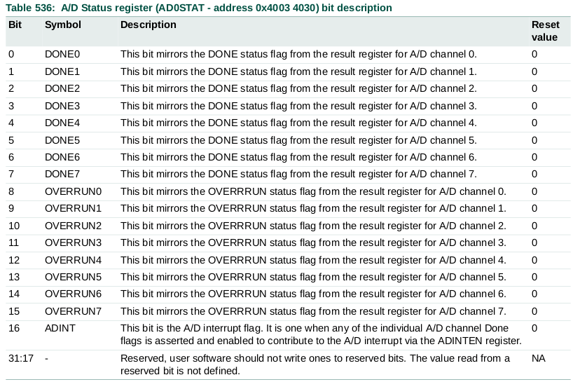

## Ejemplo

En el directorio `src` puede encontrarse un ejemplo básico de uso del ADC. Para este ejemplo se utilizan los drivers correspondientes para la configuración y uso del ADC.

En el ejemplo, se digitaliza una señal que ingresa por el pin AD0.0 y su valor binario se coloca en los primeros 12 bits del puerto 0. La conversión del ADC se inicia con una señal de Match del Timer 0.